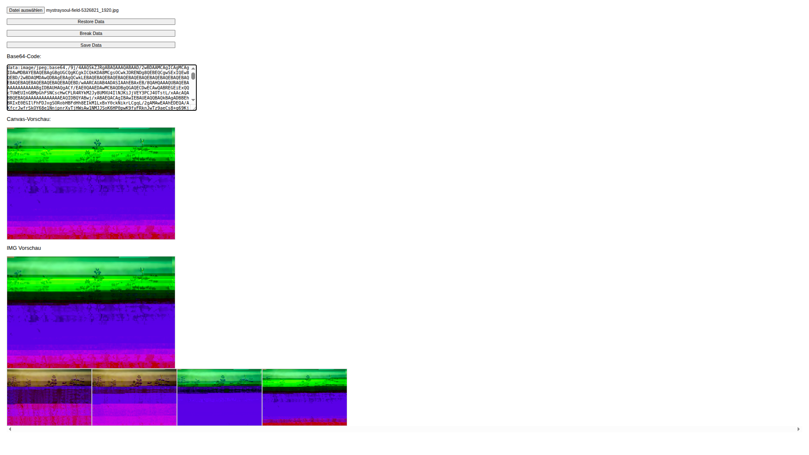
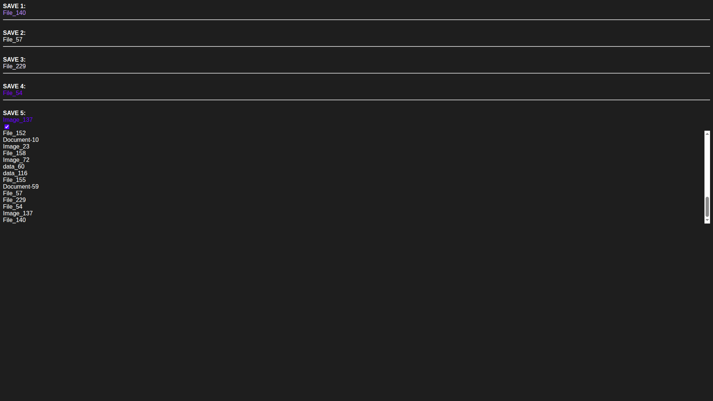

# HTML and JavaScript Models
This is an small collection of side projects,
codes where used to train and try out new ideas.

## `allHTML-Tags.html`
- I searched a random website with explanition to all HTML tags, wrote a little JS code and had all tags that I know
- Then I made sure that wouldn't use tags like `DOCTYPE` or `head`
- and done, its very caothic, but it's working

## `binary-spectogram.html`
- Basicly you give an input made out of 1 and 0's and its generate an table with each row containing "8 Bit of data"
- It's plays sounds matching to the binary code that is written in that second
- I realy don't know how to use `Web Audio API` sooo... Props to Gemini

## `collapsingFile.html`
- You upload an Image File (`png`,`jpg`,`gif`,...)
- its generating the base64 data-url
- You can edit the string manual or click `break data`
- if clicked, it will split the url into parts of 5 symbols each and choose 5 random parts that will be replaced with random letters and numbers
- if you like the look of a glitched Picture you can click `save data` to save it in the galary at the bottom of the side where you can click it to donload the picture

## `dataSaving.html`
- 0 user Interaction
- You can see how the date gets stored and if all "saves" are full there getting one after another overwritten
- 

## `exampleFilesNames.js`
- 2 Formats of a long list of file Names like `image_42.png`, simple Placeholders

## `scrollSelection.html`
- You scroll and the Selceted item changes... ***WOW***
- 

## `tabs-attempt-2.html`
- My Seconds attempt to programm Tabs
- My First attempt was like 2 years ago and failed so I made another one

Thanks for Interessting, feel free to join the Discussions...
